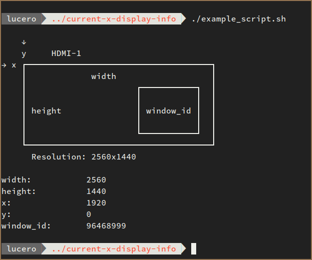

# Current X-Display Info

This repository provides an utility script to get information of the current
display, the one the mouse is over, and use it as a module in other scripts by
sourcing it.

- [Current X-Display Info](#current-x-display-info)
  - [Dependencies](#dependencies)
  - [Usage](#usage)
    - [As a module in another script](#as-a-module-in-another-script)
    - [Standalone](#standalone)

## Dependencies

This script was tested with the following dependencies, which are installed by
default in most distributions using X:

- `bash` `5`
- `xdotool` `3.20160805`+
- `xrandr` `1.5.0`+
- `grep` `3.4`+

## Usage

### As a module in another script

Minimal example:

```bash
#!/usr/bin/env bash
# example_script.sh

# Load the functions of from the script
source display_info.sh

# This loads hashmap DISPLAY_INFO
display_info::load

# Use the hashmap
echo ""
echo "    ↓"
echo "    y     ${DISPLAY_INFO[monitor_name]}"
echo "→ x ┌─────────────────────────────────────┐"
echo "    │             width                   │"
echo "    │                      ┌───────────┐  │"
echo "    │                      │           │  │"
echo "    │ height               │ window_id │  │"
echo "    │                      │           │  │"
echo "    │                      └───────────┘  │"
echo "    └─────────────────────────────────────┘"
echo "      Resolution: ${DISPLAY_INFO[resolution]}"
echo ""

echo -e "width:\t\t ${DISPLAY_INFO[width]}"
echo -e "height:\t\t ${DISPLAY_INFO[height]}"
echo -e "x:\t\t ${DISPLAY_INFO[x]}"
echo -e "y:\t\t ${DISPLAY_INFO[y]}"
echo -e "window_id:\t ${DISPLAY_INFO[window_id]}"

```

```bash
$ ./example.sh
```




### Standalone

Run the script. A list of ordered values will be shown, here I add comments explaining each of those:

```bash
$ ./display_info.sh

DISPLAY_INFO (values only):

HDMI-1       # Name of the current display
2560x1440    # Resolution of the current display
1920         # X coordinate from where the current display begins
0            # Y coordinate from where the current display begins
2560         # Width (resolution along the X axis) of the current display
1440         # Height (resolution along the Y axis) of the current display
119537707    # ID of the active window, decimal.
```

*Note*: Message "`DISPLAY_INFO (values only):`" is only for debugging purposes, it won't pollute the output if you intend to use it as it is. You can can actually do:

```bash
$ info=$(./display_info.sh)
$ name=$(echo $info | cut -d' ' -f1)
$ height=$(echo $info | cut -d' ' -f6)
$ echo "name: ${name}, height: ${height}"

name: HDMI-1, height: 1440
```
